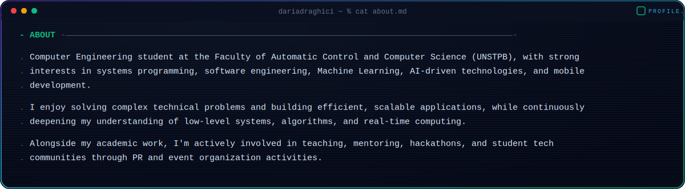
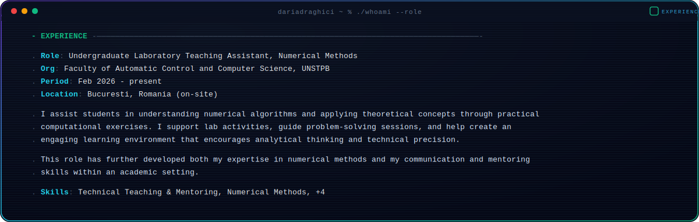
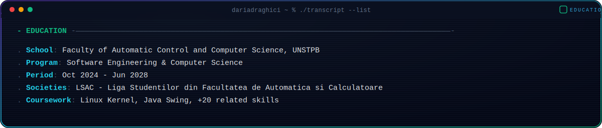
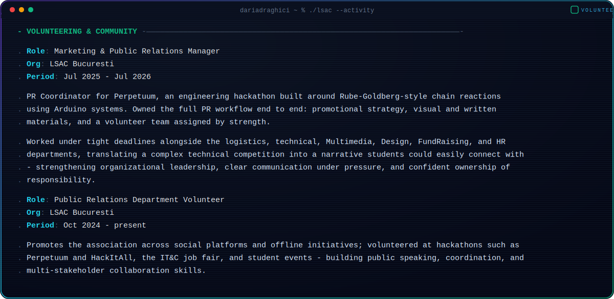
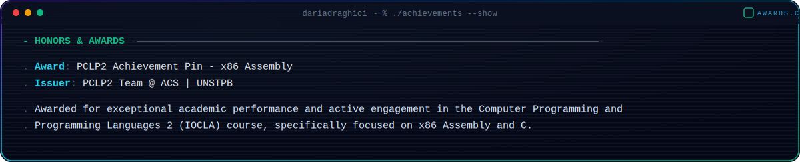
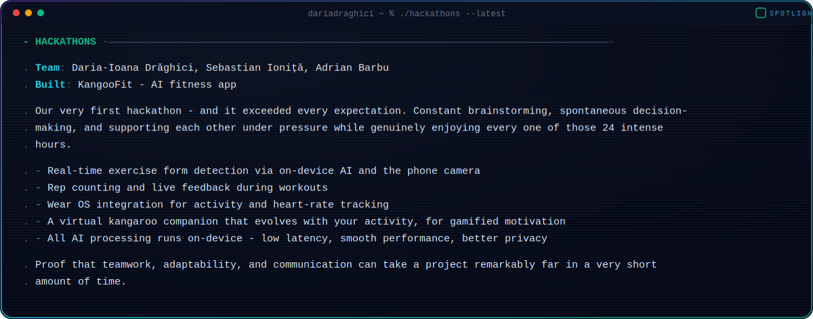

  <picture>
    <source media="(prefers-color-scheme: dark)" srcset="dark.svg">
    <source media="(prefers-color-scheme: light)" srcset="light.svg">
    
  </picture>

  

  

  

  

  

  

