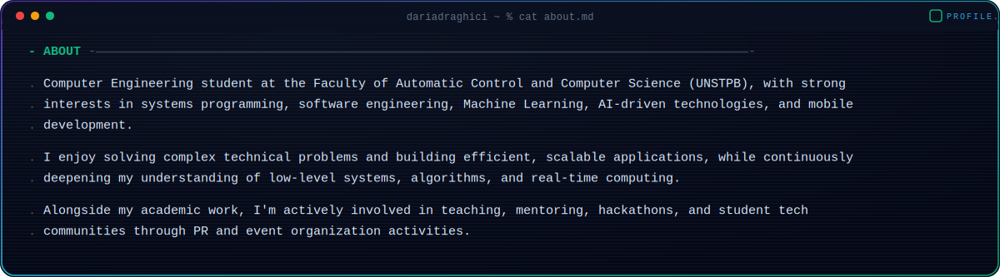
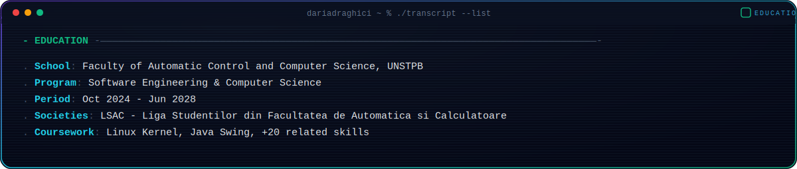
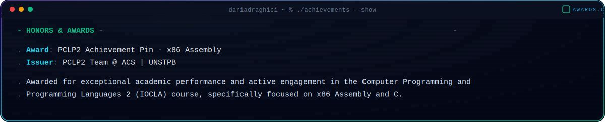

  <picture>
    <source media="(prefers-color-scheme: dark)" srcset="dark.svg">
    <source media="(prefers-color-scheme: light)" srcset="light.svg">
    
  </picture>

  <picture>
    <source media="(prefers-color-scheme: dark)" srcset="about-dark.svg">
    <source media="(prefers-color-scheme: light)" srcset="about-light.svg">
    
  </picture>

  <picture>
    <source media="(prefers-color-scheme: dark)" srcset="experience-dark.svg">
    <source media="(prefers-color-scheme: light)" srcset="experience-light.svg">
    
  </picture>

  <picture>
    <source media="(prefers-color-scheme: dark)" srcset="education-dark.svg">
    <source media="(prefers-color-scheme: light)" srcset="education-light.svg">
    
  </picture>

  <picture>
    <source media="(prefers-color-scheme: dark)" srcset="volunteering-dark.svg">
    <source media="(prefers-color-scheme: light)" srcset="volunteering-light.svg">
    
  </picture>

  <picture>
    <source media="(prefers-color-scheme: dark)" srcset="awards-dark.svg">
    <source media="(prefers-color-scheme: light)" srcset="awards-light.svg">
    
  </picture>

  <picture>
    <source media="(prefers-color-scheme: dark)" srcset="spotlight-dark.svg">
    <source media="(prefers-color-scheme: light)" srcset="spotlight-light.svg">
    
  </picture>

