  <picture>
    <source media="(prefers-color-scheme: dark)" srcset="dark/dark.svg">
    <source media="(prefers-color-scheme: light)" srcset="light/light.svg">
    
  </picture>

  <picture>
    <source media="(prefers-color-scheme: dark)" srcset="dark/about-dark.svg">
    <source media="(prefers-color-scheme: light)" srcset="light/about-light.svg">
    
  </picture>

  <picture>
    <source media="(prefers-color-scheme: dark)" srcset="dark/experience-dark.svg">
    <source media="(prefers-color-scheme: light)" srcset="light/experience-light.svg">
    
  </picture>

  <picture>
    <source media="(prefers-color-scheme: dark)" srcset="dark/education-dark.svg">
    <source media="(prefers-color-scheme: light)" srcset="light/education-light.svg">
    
  </picture>

  <picture>
    <source media="(prefers-color-scheme: dark)" srcset="dark/volunteering-dark.svg">
    <source media="(prefers-color-scheme: light)" srcset="light/volunteering-light.svg">
    
  </picture>

  <picture>
    <source media="(prefers-color-scheme: dark)" srcset="dark/awards-dark.svg">
    <source media="(prefers-color-scheme: light)" srcset="light/awards-light.svg">
    
  </picture>

  <picture>
    <source media="(prefers-color-scheme: dark)" srcset="dark/spotlight-dark.svg">
    <source media="(prefers-color-scheme: light)" srcset="light/spotlight-light.svg">
    
  </picture>

